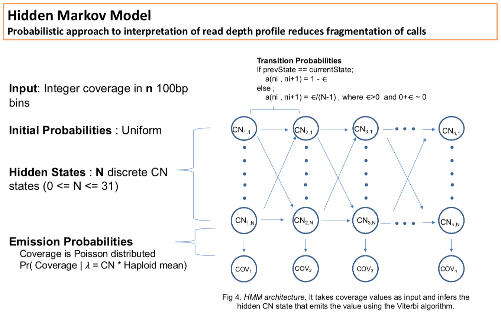

# hmcnc - Hidden Markov Copy Number Caller 
## Pipeline for calling CNVs in assemblies or alignments

---
 

---
Initially the required packages need to be installed.
On our linux cluster the easiest package management software is Anaconda/Miniconda. 

1. Download shell script (64bit):

https://docs.conda.io/en/latest/miniconda.html#linux-installers

2. Run script

`bash Miniconda3-latest-Linux-x86_64.sh`

https://docs.conda.io/projects/conda/en/latest/user-guide/install/linux.html

3. Project env - There are many ways to do this but you can set up a project specific environment with all the packages you need.

https://docs.conda.io/projects/conda/en/latest/user-guide/tasks/manage-environments.html#creating-an-environment-with-commands

### Required packages
- bedtools
- samtools
- snakemake
- boost
- R 
- gcc
- tabix

`conda create --name <proj_env> bedtools samtools snakemake boost R gcc=7.3.0`

conda install can be used to further add packages to <proj> environment with explicit version numbers.
 
`conda install -n <proj_env>  scipy=0.15.0`

4.

Always activate the env before attempting a run

`conda activate <proj_env>`

You might run into a conda init error the first time so run conda init and rerun

### Compiling cpp source files

You can either follow 5 below or run the snakemake based make file:

`snakemake -s make.smk.py --config boost=<boost>`

where `<boost>` is the location of boost install/include folder. 

Most likely `{anaconda install}/envs/{proj_env}/include`.

5.
SamToBed can be compiled: 

`g++ -02 SamToBed.cpp -o samToBed`

viterbi.noclip.cpp needs boost to compile

`g++ -W -I {anaconda install}/envs/{proj_env}/include viterbi.noclip.cpp -o viterbi`

6. fai file has to be in the same dir as asm.fa / hg38.fa / reference.fa

## Running program

`./hmcnc`

`usage: hmcnc <command> [<args>]`

Hidden Markov Copy Number Caller command options:

`asm:   Run a denovo assembly.`

`aln:   Run a reference alignment.`
	
### Alignment

`./hmcnc aln -h`

`usage:`

`    	./hmcnc aln --bam <input.bam> --index <ref.index> [<args>]`

Run HMM caller on alignment. If available, provide repeat mask annotation (--repeatMask, -r) for the reference used to filter >80 percent repeat content calls.

`./hmcnc aln`

`required arguments:`
-  --bam BAM             Bam file of Alignment, bam index file should be in same dir. (default: None)
-  --index INDEX         index file of reference/assembly coordinates (default: None)

`optional arguments:`
-  --mq MQ               Min MapQ for reads (default: 10)
-  --outdir OUTDIR       Output directory (default: .)
-  --repeatMask REPEATMASK     Provide reference based repeat bed file. (default: No)
-  --coverage COVERAGE   Provide genome-wide coverage, if not specified, caller will calculate mean coverage per contig. (default: No)
-  --subread SUBREAD     [1|0], Needs subreads filtering or not.(PacBio clr reads) (default: 0)
-  -t THREADS, --threads THREADS      Threads available (default: 1)
-  --epsi EPSI           epsilon parameter (default: 90)
-  --minL MINL           min collapse length (default: 15000)
-  --scr SCR             Scripts DIR (default: /scratch2/rdagnew/hmmnew/snakemake)
  

### Assembly 

`./hmcnc asm`

Same as above but without repeat mask step.

## Main Output

- coverage.bins.bed.gz (coverage in 100bp windows)
- copy_number.tsv (copy number profile of whole genome)
- DUPcalls.copy_number.tsv
- DUPcalls.masked_CN.tsv (calls repeat masked)
- DUPcalls.composite.bed (Bookended calls are merged)
- DUPcalls.masked_CN.composite.tsv
- {GENOME}.noclip.pdf (plot of coverage and copy number across WG)
- DELcalls.copy_number.tsv (del calls are naturally recovered)
- CallSummary.tsv

